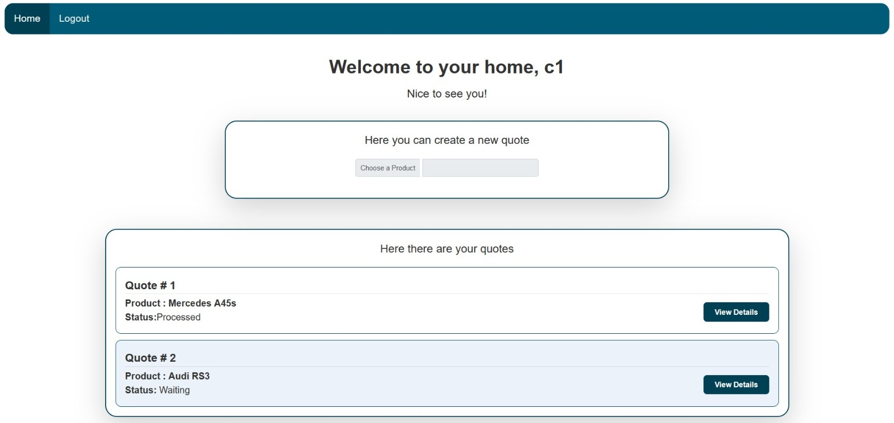
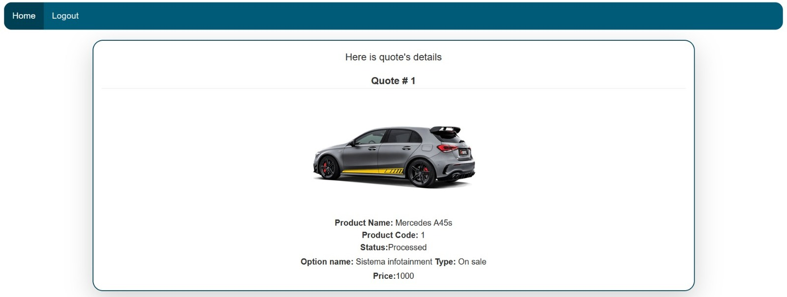
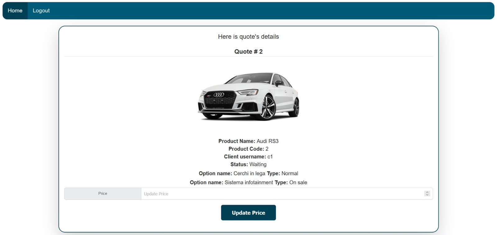
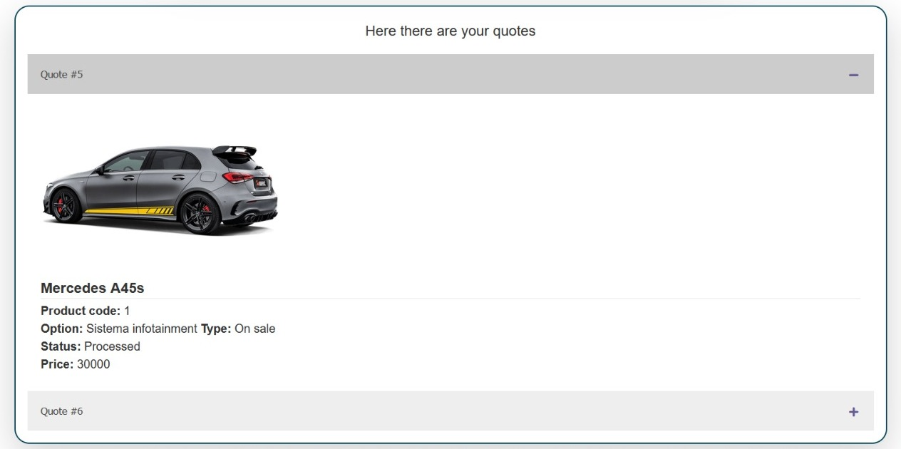
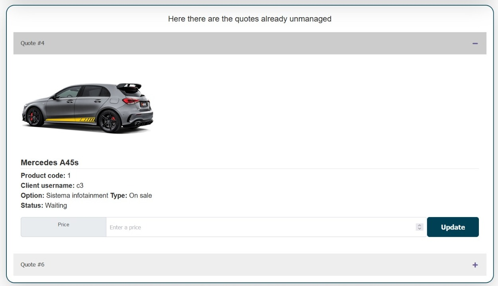
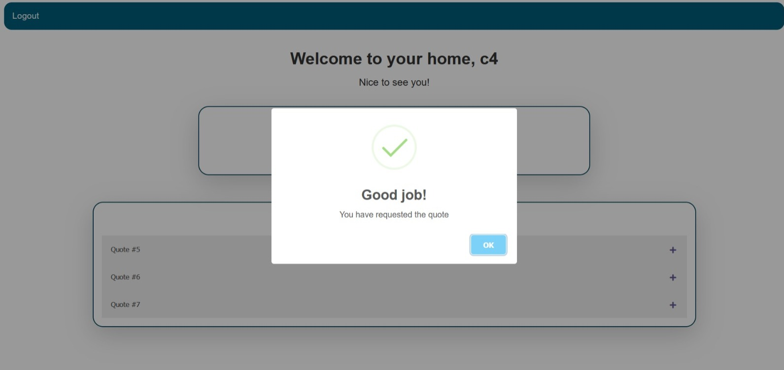

# Web-App-Project-TIW-2022-Inghilleri-Merlo
[![License: MIT][license-image]][license]

Final project for the course **"Technologies for the Web"** at Politecnico di Milano (2021/2022). 

## The Team
* [Riccardo Inghilleri](https://github.com/riccardoinghilleri)
* [Manuela Merlo](https://github.com/ManuMerlo)

## Project specification
The project consists in develop a web application that enables the management of quote requests for customized products in two versions :
* pure HTML 
* RIA

The final version includes:
* Source code of the implementation;
* Documentation

## Programming Languages 

## Frameworks

## Markup Language

## Software Used

**Eclipse** -- main IDE

**Apache Tomcat** -- Java Web Application Server

**MySQL Workbench** -- DataBase

**Draw.io** -- DataBase schema & Sequence Diagrams

**Power point** -- Application Design models

# Photos
## Pure HTML
- Login screen
 

- Client Home screen 
 

- Details page 
  

- Update Price Page
  

## One page RIA
Most of the graphics used for the html version were reused for the RIA version.

The main changes concern the display of details of a quote and the price update that is made on the home page.
 
- Details page 
  

- Update Price Page
  

Through the use of Javascript, we inserted animations to communicate successful operations and errors.

- Successful operation
  

## Copyright and license

Licensed under the **[MIT License](https://github.com/riccardoinghilleri/ing-sw-2022-inghilleri-maftei-merlo/blob/main/LICENSE)**;
you may not use this software except in compliance with the License.

[license]: https://github.com/riccardoinghilleri/ing-sw-2022-inghilleri-maftei-merlo/blob/main/LICENSE
[license-image]: https://img.shields.io/badge/License-MIT-blue.svg
